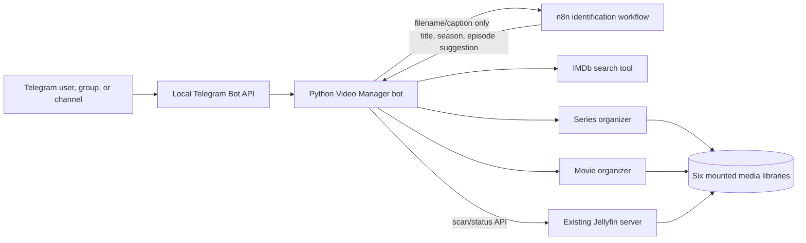

# Jellyfin Video Manager

Jellyfin Video Manager is a Telegram-driven download and organization system
for TV episodes and movies. It keeps six media destinations available at the
same time, remembers the selected destination per Telegram chat, can use an
optional n8n AI workflow to interpret release filenames, and applies all file
changes through independent, rollback-aware organizer tools.

The project supports two deployment styles:

- **NAS/Docker (recommended):** the Python bot and Local Telegram Bot API run as
  separate containers beside an existing Jellyfin installation. n8n is
  optional and remains a separate Compose project.
- **Windows:** each Python project has its own virtual environment and can be
  installed or used independently.

Jellyfin itself is not installed, replaced, or reconfigured by this project.

## What the system does

For normal use, a Telegram chat chooses one library and keeps that choice until
it is changed. The user can then send one file or a burst of files, review the
real final names, and approve one queued download plan.

For series, the bot can:

- identify title, season, and episode from the filename/caption through n8n;
- use IMDb for every selected library to obtain a canonical folder name;
- automatically reuse a conservatively matched existing series folder;
- group episodes of the same new series under one confirmation;
- route mixed-series uploads independently;
- download episodes into the selected series library and organize them as
  `Season NN/Series Title - SxxExx.ext`;
- keep successful automatic sorter output quiet while preserving diagnostics.

For movies, the bot can:

- identify a title and year automatically or accept a manual search;
- group a short burst into one compact identification result;
- automatically accept only an exact high-confidence provider title/year match;
- refuse automatic acceptance when a clear year in the source filename differs
  from the proposed movie year;
- detect library/queue identity collisions before downloading and ask whether
  to replace or cancel;
- show the exact Jellyfin destination before download;
- download into a separate staging directory;
- import the completed movie into a one-folder-per-movie layout;
- summarize a multi-movie import once instead of posting every internal step;
- preserve the staged file when import fails so the operation can be retried.

The same final-library collision check applies to identified series episodes.
An approved replacement is not a destructive overwrite: the organizer first
moves the existing video and subtitles into a hidden per-batch backup, records
both moves in rollback history, and only then installs the new media.

The organizers never depend on AI. The bot also exposes an **Advanced** menu
for manual naming, sorting, metadata repair, conflict handling, recovery, and
undo.

## System at a glance



Important boundaries:

- The Python bot is the only service that consumes Telegram updates.
- n8n receives a passive webhook request only when identification is needed.
- AI cannot select a library, access the NAS, download media, rename files, or
  scan Jellyfin.
- IMDb search proposes identity; the organizers perform deterministic file
  operations after the bot has selected or confirmed a destination.
- Jellyfin reads the same host media folders but remains a separate service.

See [System design](docs/SYSTEM_DESIGN.md) for the complete flow and trust
boundaries.

## Repository layout

```text
video-manager/
|-- telegram_jellyfin_bot/       Telegram polling, menus, queue, and downloads
|-- organizer/                   Independent TV-series organizer and rollback
|-- movie_organizer/             Independent staged movie importer and rollback
|-- fuzzy_search/                Optional IMDb fuzzy-title search and cache
|-- nas/                         Separate Docker Compose deployment templates
|-- docs/                        Architecture, configuration, and operations
|-- Dockerfile                   Python bot plus all independent local tools
|-- Dockerfile.telegram-bot-api  Runtime for the supplied Linux API binary
|-- telegram-bot-api             Linux amd64 Local Bot API binary
|-- telegram-bot-api.sha256      Integrity check for that binary
`-- update.bat                   Safe updater for a Windows Git clone
```

The five Python sub-projects remain usable separately:

| Component | Can run alone | External dependency |
|---|---:|---|
| Telegram bot | Yes | Local Telegram Bot API; other tools are optional by feature |
| Series organizer | Yes | `guessit` is optional but recommended |
| Movie organizer | Yes | Python standard library only |
| IMDb fuzzy search | Yes | IMDb search endpoint; cached exact queries can work offline |

Supported video extensions are `.mkv`, `.mp4`, `.avi`, `.mov`, `.webm`, and
`.m4v`. The organizers also recognize `.srt`, `.ass`, and `.vtt` subtitle
sidecars and preserve extensions. The Telegram queue accepts video extensions;
matching subtitle files already present beside a video are handled by the
standalone organizers.

## Media layout

The recommended NAS deployment mounts six existing Jellyfin library roots:

```text
VIDEO_ARCHIVE/jellyfin/
|-- animation-serise/   # animated TV series (spelling kept for existing path)
|-- animation-movie/    # animated movies
|-- video-serise/       # live-action TV series
|-- video-movie/        # live-action movies
|-- anime-series/       # separate anime series library
`-- anime-movie/        # separate anime movie library
```

Inside a series library:

```text
animation-serise/
`-- Witch Hat Atelier (2026) [imdbid-tt32550889]/
    `-- Season 01/
        |-- Witch Hat Atelier - S01E01.mkv
        `-- Witch Hat Atelier - S01E01.fa.srt
```

The year and provider ID belong to the series folder. They are intentionally
removed from the episode filename.

Inside a movie library:

```text
video-movie/
`-- Interstellar (2014) [imdbid-tt0816692]/
    |-- Interstellar (2014) [imdbid-tt0816692].mkv
    `-- Interstellar (2014) [imdbid-tt0816692].fa.srt
```

## Recommended NAS/Docker setup

Prerequisites:

- x86-64 Linux NAS;
- Docker Engine and Docker Compose;
- an existing, working Jellyfin server;
- a Telegram bot token from BotFather;
- Telegram `api_id` and `api_hash` from `my.telegram.org`;
- six existing host media directories;
- optional: a Jellyfin API key and an existing n8n instance/workflow.

Clone the repository beneath the directory that already contains the Jellyfin
Compose project, then create the independent automation stacks:

```bash
cd /srv/dev-disk-by-uuid-e5048a2d-8521-41d1-8efc-880e999ecc6f/Archive/jellyfin-compose
git clone https://github.com/shiny222/vedio_name_manager__bot-telegram.git source
bash source/nas/install-or-update.sh "$PWD"
```

The script synchronizes Compose templates, creates missing `.env` files and
persistent directories, verifies the committed Local Bot API checksum, and
creates the shared `media-automation` network. It does **not** edit, stop,
recreate, or reinstall Jellyfin. It also never overwrites an existing `.env`.

After editing the generated environment files, start these independent stacks
in order:

1. `telegram-bot-api-compose`
2. `n8n-compose` if AI identification is wanted
3. `video-manager-compose`

Use the exact commands and validation checks in
[NAS Docker setup](nas/README.md). Every configuration value is explained in
[Configuration reference](docs/CONFIGURATION.md).

## Windows setup

Windows is useful for standalone tools or a non-Docker bot installation.

1. Install Python 3.10 or newer and Git for Windows.
2. Clone this repository; do not use a ZIP if you want easy updates:

   ```powershell
   git clone https://github.com/shiny222/vedio_name_manager__bot-telegram.git
   cd vedio_name_manager__bot-telegram
   ```

3. Run the installers for the features you need:

   ```text
   telegram_jellyfin_bot\install.bat
   organizer\install.bat
   movie_organizer\install.bat
   fuzzy_search\install.bat
   ```

4. Edit `telegram_jellyfin_bot\config.json`. It is created from
   `config.example.json` and ignored by Git.
5. Start `telegram_jellyfin_bot\run_local_bot_api.bat`.
6. In a second window, start `telegram_jellyfin_bot\run.bat`.

For standalone command examples, open the README inside
[organizer](organizer/README.md), [movie organizer](movie_organizer/README.md),
or [fuzzy search](fuzzy_search/README.md).

## Everyday bot workflow

1. Send `/language` once and choose English or Persian.
2. Send `/menu`, choose **Choose Library**, and select the correct destination.
3. Send one or several videos. The library selection persists for that chat.
4. Let the compact identification batch finish. Existing reliable series
   folders are reused automatically, and exact high-confidence movie title/year
   matches are queued automatically. The bot asks only when an identity is new,
   ambiguous, or inconsistent.
5. Open **Downloads → Download** and review the exact final saved filenames.
6. Press **Confirm** or send `/confirm_download`.
7. Use `/status`, `/sort_status`, or `/movie_current` only when more detail is
   needed.

The complete English and Persian guide is in
[How to use the bot](telegram_jellyfin_bot/HOW_TO_USE.md) and is also available
inside Telegram through `/guide`.

## Safety and rollback

The system is designed around these invariants:

- no silent overwrite;
- paths must stay under the selected configured library;
- incomplete downloads use `.part` files;
- final byte count is checked against Telegram's reported size when available;
- series downloads keep their real Telegram filename until the organizer has
  completed an automatic dry-run;
- movies download outside the final library and are imported only after a
  successful internal dry-run;
- every organizer move is recorded in `.rename_history.json`;
- an append-only operation journal is flushed before important file moves;
- undo verifies the current file, its byte count, and the availability of the
  original path;
- interrupted operations are repaired only by an explicit per-folder recovery
  command, never by continuous background scanning.

History files are small audit metadata; they are not duplicate copies of the
video. Do not delete them while rollback may still be required.

See [System design](docs/SYSTEM_DESIGN.md#safety-model) and
[Operations and recovery](docs/OPERATIONS.md) for exact behavior.

## Persistence and privacy

The bot stores queue and per-chat state in SQLite using WAL mode. Each Telegram
chat has independent language, selected library, current series folder, queue,
confirmation state, recent jobs, and owned sorter history. Users in the same
Telegram group share one chat namespace because Telegram gives the group one
chat ID.

If `ALLOWED_CHAT_IDS`/`allowed_chat_ids` is empty, anyone who can reach the bot
can use it. There is no account system. Restrict the bot token and Telegram
membership appropriately, because authorized users can initiate downloads,
file organization, undo, and Jellyfin scans.

Only filename/caption identification data is sent to n8n/AI. The n8n workflow
does not receive the media file and cannot access the media mounts through this
project's Compose configuration.

## Updating

### NAS

```bash
cd /srv/dev-disk-by-uuid-e5048a2d-8521-41d1-8efc-880e999ecc6f/Archive/jellyfin-compose
git -C source pull --ff-only
bash source/nas/install-or-update.sh "$PWD"
cd video-manager-compose
docker compose build --pull
docker compose up -d
```

Rebuilding is required for Python source or dependency changes because source
files are copied into the image. Editing only `.env` does not require a build;
recreate the service with `docker compose up -d`.

### Windows

Stop both bot windows and run the root `update.bat`. It refuses to pull over
tracked local changes, uses `git pull --ff-only`, refreshes dependencies in
existing virtual environments, and preserves ignored configuration, databases,
logs, downloads, and virtual environments.

## Backups and recovery

At minimum, back up:

- `video-manager-compose/.env`;
- `video-manager-compose/data/` (including SQLite WAL/SHM files while stopped);
- `video-manager-compose/staging/` if it contains unfinished movies;
- `telegram-bot-api-compose/.env` and `data/` if Local Bot API continuity is
  important;
- `n8n-compose/.env` and `data/`, especially the original encryption key;
- `.rename_history.json`, `.operation_journal.jsonl`, and folder-rename history
  stored inside media folders.

Stop the affected container before copying live SQLite or n8n data. Full backup,
restore, update rollback, and power-loss recovery procedures are documented in
[Operations and recovery](docs/OPERATIONS.md).

## Documentation map

- [System design](docs/SYSTEM_DESIGN.md) — components, data flows, state,
  naming, trust boundaries, and failure behavior.
- [Configuration reference](docs/CONFIGURATION.md) — every Docker `.env`
  setting, Windows configuration, credentials, and path rules.
- [Operations and recovery](docs/OPERATIONS.md) — startup, validation, updates,
  backups, permissions, diagnostics, undo, and incident response.
- [NAS Docker setup](nas/README.md) — exact first installation on the current
  NAS layout without changing Jellyfin.
- [n8n filename agent](nas/n8n-workflows/README.md) — import, authentication,
  request/response contract, and testing.
- [Bilingual bot guide](telegram_jellyfin_bot/HOW_TO_USE.md) — routine and
  advanced user workflows in English and Persian.
- [Telegram bot reference](telegram_jellyfin_bot/README.md) — standalone
  Windows setup, commands, and bot-specific behavior.
- [Series organizer](organizer/README.md),
  [movie organizer](movie_organizer/README.md), and
  [IMDb fuzzy search](fuzzy_search/README.md) — independent tool usage.

## Tests

Run the bot suite from the repository root. Run each standalone tool's suite
from that tool's folder because its tests intentionally import the local script
as a standalone module:

```powershell
telegram_jellyfin_bot\.venv\Scripts\python.exe -m unittest discover -s telegram_jellyfin_bot\tests -v

Set-Location organizer
.\.venv\Scripts\python.exe -m unittest test_organizer.py -v

Set-Location ..\fuzzy_search
.\.venv\Scripts\python.exe -m unittest test_imdb_tool.py -v

```

The Local Telegram Bot API integration test is skipped unless its explicit test
environment is enabled. Tests do not replace a dry-run before organizing real
media.
